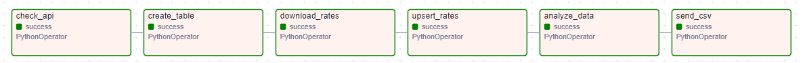
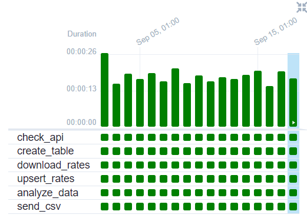

# Forex Data Pipeline

## DAG Visualization



*The above image represents the DAG created for the Forex Data Pipeline.*

## Solution Description

The Forex Data Pipeline is an Apache Airflow DAG designed to automate the retrieval and analysis of foreign exchange rates. The pipeline performs the following steps:

1. **API Availability Check**: Verifies that the Forex API is accessible before attempting to fetch data.
2. **Table Creation**: Creates a PostgreSQL table for storing forex rates if it doesn't already exist.
3. **Data Download**: Fetches the latest forex rates from the API for the previous day and stores them in a CSV file.
4. **Data Upsert**: Inserts new rates into the PostgreSQL database or updates existing records if they conflict.
5. **Data Analysis**: Analyzes the forex rates to find the maximum change in rates and generates a report.
6. **Notification**: Sends the results via Telegram to notify interested parties.

This pipeline ensures that forex rate data is consistently updated and that stakeholders are notified of significant changes.

## DAG Output



*The above image shows the output of the DAG after successful execution, including the generated reports and notifications.*

## Setup Instructions
You should run the following commands on the project folder:

```bash
# Make expected directories
mkdir -p ./dags ./logs ./plugins

# Initialize the database
docker compose up airflow-init

# Start up all services
docker compose up

